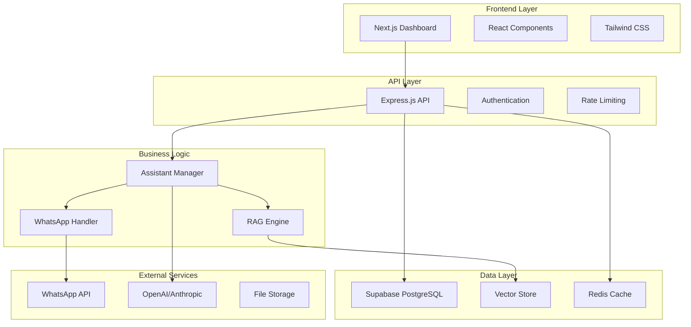

# AIDA Platform - Plataforma de Assistentes WhatsApp com IA

Plataforma simplificada para criação e gerenciamento de assistentes de IA no WhatsApp, integrada com Evolution API e sistema de cobrança de R$250/mês por instância.

## 🚀 Funcionalidades

- **Autenticação via WhatsApp**: Login com código de 6 dígitos enviado via WhatsApp
- **Conexão WhatsApp**: Integração completa com Evolution API para gerenciar instâncias
- **Cérebro do Assistente**: Configuração estruturada com engenharia de contexto
- **Catálogo de Produtos**: Gerenciamento de produtos com busca vetorial
- **Sistema RAG Híbrido**: Combinação de grafos de conhecimento e busca vetorial
- **Cobrança Automatizada**: R$250/mês por instância com período de carência de 30 dias
- **Interface Moderna**: UI responsiva com Tailwind CSS e shadcn/ui

### ✨ Características Principais

- **🏢 Arquitetura Multi-Tenant**: Isolamento completo de dados entre organizações
- **🧠 RAG Híbrido**: Combinação de busca vetorial e keyword search para máxima precisão
- **📱 Integração WhatsApp**: Suporte nativo às APIs oficiais do WhatsApp Business
- **⚡ Performance**: Otimizado para alta concorrência e baixa latência
- **🔒 Segurança**: Criptografia end-to-end e compliance com LGPD/GDPR
- **📊 Analytics**: Dashboards em tempo real com métricas detalhadas
- **🔧 Extensível**: Arquitetura modular para fácil customização

## 🏗️ Arquitetura do Sistema



## 📁 Estrutura do Projeto

```
aida-platform/
├── 📁 frontend/                 # Interface web (Next.js)
│   ├── 📁 app/                 # App Router do Next.js 14
│   ├── 📁 components/          # Componentes React reutilizáveis
│   ├── 📁 lib/                 # Utilitários e configurações
│   └── 📁 public/              # Assets estáticos
├── 📁 backend/                  # API e lógica de negócio
│   ├── 📁 src/
│   │   ├── 📁 controllers/     # Controladores da API
│   │   ├── 📁 services/        # Lógica de negócio
│   │   ├── 📁 models/          # Modelos de dados
│   │   ├── 📁 middleware/      # Middlewares Express
│   │   └── 📁 utils/           # Utilitários
│   └── 📁 tests/               # Testes automatizados
├── 📁 shared/                   # Código compartilhado
│   ├── 📁 types/               # Definições TypeScript
│   ├── 📁 schemas/             # Schemas de validação
│   └── 📁 constants/           # Constantes globais
├── 📁 docs/                     # Documentação
└── 📁 .github/                  # Workflows CI/CD
```

## 🛠️ Tecnologias Utilizadas

### Frontend
- **Next.js 14**: Framework React com App Router
- **TypeScript**: Tipagem estática
- **Tailwind CSS**: Framework CSS utilitário
- **Shadcn/ui**: Componentes UI modernos
- **React Hook Form**: Gerenciamento de formulários
- **Zustand**: Gerenciamento de estado

### Backend
- **Node.js**: Runtime JavaScript
- **Express.js**: Framework web
- **TypeScript**: Tipagem estática
- **Supabase**: Backend-as-a-Service
- **PostgreSQL**: Banco de dados principal
- **Redis**: Cache e sessões
- **Prisma**: ORM TypeScript

### IA e ML
- **OpenAI GPT-4**: Modelo de linguagem principal
- **Anthropic Claude**: Modelo alternativo
- **LangChain**: Framework para aplicações LLM
- **Pinecone/Weaviate**: Vector database
- **Sentence Transformers**: Embeddings

### DevOps e Infraestrutura
- **Docker**: Containerização
- **Vercel**: Deploy do frontend
- **Railway/Render**: Deploy do backend
- **GitHub Actions**: CI/CD
- **Sentry**: Monitoramento de erros

## 🚀 Início Rápido

### Pré-requisitos
- Node.js 18+
- npm ou yarn
- Docker (opcional)
- Conta Supabase
- Chaves API (OpenAI, WhatsApp)

### Instalação

1. **Clone o repositório**
```bash
git clone https://github.com/Letteriello/aida-assistentes-platform.git
cd aida-assistentes-platform
```

2. **Instale as dependências**
```bash
# Frontend
cd frontend
npm install

# Backend
cd ../backend
npm install

# Shared
cd ../shared
npm install
```

3. **Configure as variáveis de ambiente**
```bash
# Frontend (.env.local)
cp frontend/.env.example frontend/.env.local

# Backend (.env)
cp backend/.env.example backend/.env
```

4. **Configure o banco de dados**
```bash
cd backend
npx prisma migrate dev
npx prisma db seed
```

5. **Inicie os serviços**
```bash
# Terminal 1 - Backend
cd backend
npm run dev

# Terminal 2 - Frontend
cd frontend
npm run dev
```

### Configuração com Docker

```bash
# Construir e iniciar todos os serviços
docker-compose up --build

# Apenas desenvolvimento
docker-compose -f docker-compose.dev.yml up
```

## ⚙️ Configuração

### Variáveis de Ambiente

#### Frontend (.env.local)
```env
NEXT_PUBLIC_SUPABASE_URL=your_supabase_url
NEXT_PUBLIC_SUPABASE_ANON_KEY=your_supabase_anon_key
NEXT_PUBLIC_API_URL=http://localhost:8787
```

#### Backend (.env)
```env
# Database
SUPABASE_URL=your_supabase_url
SUPABASE_SERVICE_ROLE_KEY=your_service_role_key

# AI Services
OPENAI_API_KEY=your_openai_key
ANTHROPIC_API_KEY=your_anthropic_key

# WhatsApp Integration
EVOLUTION_API_URL=your_evolution_api_url
EVOLUTION_API_KEY=your_evolution_api_key

# Security
JWT_SECRET=your_jwt_secret
ENCRYPTION_KEY=your_encryption_key
```

## 📚 Documentação

- [Guia de Instalação](docs/installation.md)
- [API Reference](docs/api.md)
- [Arquitetura](docs/architecture.md)
- [Deploy](docs/deployment.md)
- [Contribuição](docs/contributing.md)

## 🤝 Contribuição

1. Fork o projeto
2. Crie uma branch para sua feature (`git checkout -b feature/AmazingFeature`)
3. Commit suas mudanças (`git commit -m 'Add some AmazingFeature'`)
4. Push para a branch (`git push origin feature/AmazingFeature`)
5. Abra um Pull Request

## 📄 Licença

Este projeto está sob a licença MIT. Veja o arquivo [LICENSE](LICENSE) para mais detalhes.

## 📞 Suporte

- 📧 Email: suporte@aida-platform.com
- 💬 Discord: [AIDA Community](https://discord.gg/aida)
- 📖 Documentação: [docs.aida-platform.com](https://docs.aida-platform.com)

---

**AIDA Platform** - Transformando atendimento com IA 🚀