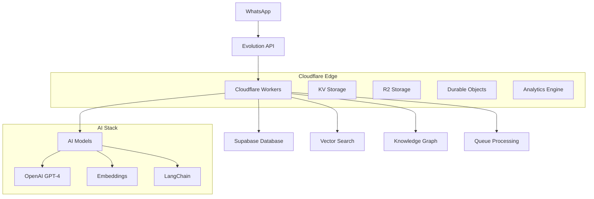

# AIDA Platform - Backend

<<<<<<< HEAD
> **🚀 Intelligent WhatsApp Assistant Platform powered by Cloudflare Workers**

A complete backend solution for managing AI-powered WhatsApp assistants with advanced RAG capabilities, multi-tenancy, and real-time processing.

## 🏗️ Architecture Overview



## ✨ Features

### 🤖 AI & RAG
- **Hybrid RAG System**: Vector + Text + Graph search
- **Multi-Model Support**: OpenAI GPT-4, Claude, Cloudflare AI
- **Smart Embeddings**: Automatic generation and optimization
- **Context-Aware Responses**: Conversation history and business knowledge

### 🏢 Multi-Tenancy
- **Business Isolation**: Complete data separation
- **Role-Based Access**: Admin, Manager, Agent roles
- **Subscription Plans**: Free, Pro, Enterprise tiers
- **Resource Limits**: Per-business quotas and rate limiting

### 📱 WhatsApp Integration
- **Evolution API**: Complete WhatsApp Business API integration
- **Real-time Webhooks**: Instant message processing
- **Media Support**: Images, documents, audio messages
- **Message Queue**: Reliable async processing

### 🔒 Security & Performance
- **Row-Level Security**: Database-level tenant isolation
- **JWT Authentication**: Secure API access
- **Rate Limiting**: DDoS protection and fair usage
- **Edge Computing**: Global low-latency deployment
=======
## 🚀 Overview

The AIDA Platform backend is a robust, scalable system built for managing AI-powered WhatsApp assistants. It provides a comprehensive API for authentication, assistant management, conversation handling, and advanced RAG (Retrieval Augmented Generation) capabilities.

## ✨ Features

- **🔐 WhatsApp Authentication**: Secure phone-based authentication system
- **🤖 Assistant Management**: Create and configure AI assistants with custom personalities
- **💬 Conversation Handling**: Real-time message processing with Evolution API integration
- **🧠 Hybrid RAG System**: Combines vector search and knowledge graphs for intelligent responses
- **📊 Analytics**: Comprehensive usage tracking and performance metrics
- **🔒 Multi-tenant Security**: Complete data isolation between organizations
- **⚡ High Performance**: Optimized for low latency and high concurrency

## 🏗️ Architecture

### Core Services
- **Authentication Service**: WhatsApp-based user verification
- **Assistant Service**: AI assistant configuration and management
- **Conversation Service**: Message processing and response generation
- **RAG Engine**: Hybrid search combining vectors and knowledge graphs
- **Evolution API Integration**: WhatsApp Business API management

### Data Layer
- **Supabase PostgreSQL**: Primary database with vector extensions
- **Neo4j**: Knowledge graph for complex relationship queries
- **Redis**: Caching and session management
>>>>>>> 71f4edea800491fc84c14ab6e43a6a974d0180c1

## 🚀 Quick Start

### Prerequisites
<<<<<<< HEAD

- **Node.js** 18+ and npm
- **Cloudflare Account** with Workers plan
- **Supabase Project** with pgvector extension
- **OpenAI API Key** for AI capabilities
- **Evolution API Instance** for WhatsApp

### 1. Environment Setup

```bash
# Clone and navigate
git clone <repository-url>
cd aida-platform/backend

# Install dependencies
npm install

# Copy environment template
cp .env.example .env.local
```

### 2. Configure Environment

Edit `.env.local` with your actual values:

```bash
# Supabase Configuration
SUPABASE_URL=https://your-project.supabase.co
SUPABASE_ANON_KEY=your-anon-key
SUPABASE_SERVICE_ROLE_KEY=your-service-role-key

# OpenAI Configuration
OPENAI_API_KEY=sk-your-openai-api-key
OPENAI_MODEL=gpt-4o-mini
OPENAI_EMBEDDING_MODEL=text-embedding-3-small

# Evolution API Configuration
EVOLUTION_API_KEY=your-evolution-api-key
EVOLUTION_API_BASE_URL=https://api.evolution-api.com
EVOLUTION_WEBHOOK_SECRET=your-webhook-secret
```

### 3. Database Setup

```bash
# Run database migrations
npm run db:migrate

# Seed initial data (optional)
npm run db:seed
```

### 4. Development Server

```bash
# Start development server
npm run dev

# Server will be available at http://localhost:8787
```

### 5. Deploy to Production

```bash
# Configure Cloudflare secrets
npm run deploy:secrets

# Deploy to Cloudflare Workers
npm run deploy
=======
- Node.js 18+
- npm or yarn
- Supabase account
- Evolution API instance
- OpenAI API key

### Installation

1. **Clone and install dependencies**
```bash
cd backend
npm install
```

2. **Configure environment**
```bash
cp .env.example .env.local
# Edit .env.local with your actual values
```

3. **Start development server**
```bash
# For MVP Express server
npm run dev:mvp

# For Cloudflare Workers (production)
npm run dev
>>>>>>> 71f4edea800491fc84c14ab6e43a6a974d0180c1
```

## 📁 Project Structure

```
backend/
├── src/
<<<<<<< HEAD
│   ├── ai/                    # AI and LangChain integration
│   │   ├── langchain-setup.ts  # LangChain configuration
│   │   └── response-generator.ts # AI response generation
│   ├── api/                   # API route handlers
│   │   ├── assistants.ts      # Assistant management
│   │   └── conversations.ts   # Conversation handling
│   ├── auth/                  # Authentication & authorization
│   │   ├── business-auth.ts   # Business-level auth
│   │   └── tenant-isolation.ts # Multi-tenant security
│   ├── database/              # Database layer
│   │   ├── client.ts          # Supabase client
│   │   ├── database.types.ts  # TypeScript types
│   │   └── migrations/        # SQL migrations
│   ├── evolution-api/         # WhatsApp integration
│   │   ├── client.ts          # Evolution API client
│   │   ├── message-formatter.ts # Message formatting
│   │   └── webhook-handler.ts # Webhook processing
│   ├── memory/                # Knowledge management
│   │   ├── business-knowledge.ts # Business-specific knowledge
│   │   └── conversation-history.ts # Chat history
│   ├── rag/                   # Retrieval Augmented Generation
│   │   ├── embedding-service.ts # Vector embeddings
│   │   ├── graph-search.ts    # Knowledge graph search
│   │   ├── hybrid-query-engine.ts # Hybrid search
│   │   └── vector-search.ts   # Vector similarity search
│   ├── tests/                 # Test suites
│   └── index.ts              # Main application entry
├── wrangler.toml             # Cloudflare Workers config
├── package.json              # Dependencies and scripts
└── README.md                 # This file
=======
│   ├── api/                   # API route handlers
│   │   ├── auth.ts           # Authentication endpoints
│   │   ├── assistants.ts     # Assistant management
│   │   ├── conversations.ts  # Conversation handling
│   │   └── webhooks.ts       # Webhook endpoints
│   ├── services/             # Business logic
│   │   ├── auth/             # Authentication services
│   │   ├── assistants/       # Assistant management
│   │   ├── conversations/    # Message processing
│   │   ├── rag/              # RAG engine
│   │   └── evolution-api/    # WhatsApp integration
│   ├── database/             # Database utilities
│   │   ├── supabase.ts       # Supabase client
│   │   ├── neo4j.ts          # Neo4j driver
│   │   └── migrations/       # Database migrations
│   ├── types/                # TypeScript definitions
│   └── utils/                # Utility functions
├── tests/                    # Test suites
├── scripts/                  # Development scripts
├── wrangler.toml            # Cloudflare Workers config
└── package.json             # Dependencies and scripts
>>>>>>> 71f4edea800491fc84c14ab6e43a6a974d0180c1
```

## 🔧 Development

### Available Scripts

```bash
# Development
<<<<<<< HEAD
npm run dev              # Start development server
npm run build            # Build for production
npm run deploy           # Deploy to Cloudflare Workers

# Database
npm run db:migrate       # Run database migrations
npm run db:reset         # Reset database
npm run db:seed          # Seed test data
npm run db:types         # Generate TypeScript types

# Testing
npm run test             # Run all tests
npm run test:unit        # Unit tests only
npm run test:integration # Integration tests
npm run test:e2e         # End-to-end tests
npm run test:load        # Load testing
npm run test:security    # Security tests

# Utilities
npm run lint             # Code linting
npm run format           # Code formatting
npm run type-check       # TypeScript checking
=======
npm run dev:mvp          # Start MVP Express server
npm run dev              # Start Cloudflare Workers dev
npm run build            # Build for production

# Testing
npm run test             # Run all tests
npm run test:watch       # Watch mode
npm run test:coverage    # Coverage report

# Code Quality
npm run lint             # ESLint
npm run format           # Prettier
npm run type-check       # TypeScript check
>>>>>>> 71f4edea800491fc84c14ab6e43a6a974d0180c1
```

### Environment Variables

<<<<<<< HEAD
See `.env.example` for all available configuration options:

- **Database**: Supabase connection and credentials
- **AI Models**: OpenAI, Anthropic API keys and models
- **WhatsApp**: Evolution API configuration
- **Security**: JWT secrets, encryption keys
- **Performance**: Rate limits, timeouts, batch sizes
- **Features**: Feature flags for optional functionality

## 🧪 Testing

### Test Categories

1. **Unit Tests**: Individual component testing
2. **Integration Tests**: API endpoint testing
3. **E2E Tests**: Complete workflow testing
4. **Load Tests**: Performance and scalability
5. **Security Tests**: Authentication and authorization
6. **Tenant Isolation**: Multi-tenancy validation

### Running Tests

```bash
# Run specific test suites
npm run test:unit
npm run test:integration
npm run test:e2e
npm run test:load
npm run test:security
npm run test:tenant-isolation

# Run tests with coverage
npm run test:coverage

# Run tests in watch mode
npm run test:watch
=======
See `.env.example` for all required environment variables. Key configurations:

- **Supabase**: Database and authentication
- **Evolution API**: WhatsApp integration
- **OpenAI**: AI model access
- **Neo4j**: Knowledge graph database

## 🧪 Testing

### Test Structure
```bash
tests/
├── unit/                # Unit tests
├── integration/         # Integration tests
├── e2e/                # End-to-end tests
└── fixtures/           # Test data
```

### Running Tests
```bash
# All tests
npm run test:all

# Specific test suites
npm run test:auth
npm run test:assistants
npm run test:conversations

# Load testing
npm run test:load

# Security testing
npm run test:security
>>>>>>> 71f4edea800491fc84c14ab6e43a6a974d0180c1
```

## 🚀 Deployment

<<<<<<< HEAD
### Cloudflare Workers Setup

1. **Install Wrangler CLI**:
   ```bash
   npm install -g wrangler
   wrangler login
   ```

2. **Configure Resources**:
   ```bash
   # Create KV namespaces
   wrangler kv:namespace create "CACHE_STORE"
   wrangler kv:namespace create "SESSION_STORE"
   wrangler kv:namespace create "RATE_LIMIT_STORE"
   
   # Create R2 buckets
   wrangler r2 bucket create aida-platform-media
   wrangler r2 bucket create aida-platform-backups
   
   # Create queues
   wrangler queues create embedding-queue
   wrangler queues create message-queue
   wrangler queues create webhook-queue
   ```

3. **Set Secrets**:
   ```bash
   wrangler secret put SUPABASE_SERVICE_ROLE_KEY
   wrangler secret put OPENAI_API_KEY
   wrangler secret put EVOLUTION_API_KEY
   wrangler secret put JWT_SECRET
   wrangler secret put ENCRYPTION_KEY
   ```

4. **Deploy**:
   ```bash
   npm run deploy
   ```

=======
>>>>>>> 71f4edea800491fc84c14ab6e43a6a974d0180c1
### Production Checklist

- [ ] Environment variables configured
- [ ] Database migrations applied
- [ ] Cloudflare resources created
<<<<<<< HEAD
- [ ] Secrets properly set
- [ ] Custom domain configured
- [ ] SSL certificates active
- [ ] Monitoring and alerts setup
- [ ] Backup strategy implemented
=======
- [ ] Evolution API configured
- [ ] Monitoring setup

### Cloudflare Workers Deployment

```bash
# Deploy to staging
npm run deploy:staging

# Deploy to production
npm run deploy:production
```

### MVP Express Server Deployment

```bash
# Build for production
npm run build:mvp

# Start production server
npm run start:mvp
```
>>>>>>> 71f4edea800491fc84c14ab6e43a6a974d0180c1

## 📊 Monitoring

### Health Checks
<<<<<<< HEAD

- **Endpoint**: `GET /health`
- **Components**: Database, AI services, Evolution API
- **Metrics**: Response times, error rates, resource usage

### Analytics

- **Cloudflare Analytics**: Request metrics and performance
- **Custom Events**: Business metrics and user interactions
- **Error Tracking**: Automated error reporting and alerting

### Logging

```bash
# View real-time logs
wrangler tail

# View specific log levels
wrangler tail --format=pretty --level=error
=======
```bash
# Check service health
curl http://localhost:8787/health

# MVP server health
curl http://localhost:3000/health
```

### Logging
```bash
# View logs (Cloudflare)
npm run logs

# Production logs
npm run logs:production
>>>>>>> 71f4edea800491fc84c14ab6e43a6a974d0180c1
```

## 🔒 Security

<<<<<<< HEAD
### Authentication Flow

1. **Business Registration**: Admin creates business account
2. **User Invitation**: Admin invites team members
3. **JWT Tokens**: Secure API access with role-based permissions
4. **Session Management**: Secure session handling with KV storage

### Data Protection

- **Encryption**: All sensitive data encrypted at rest
- **Row-Level Security**: Database-level tenant isolation
- **API Rate Limiting**: DDoS protection and fair usage
- **Input Validation**: Comprehensive request validation

## 🤝 Contributing

1. **Fork** the repository
2. **Create** a feature branch: `git checkout -b feature/amazing-feature`
3. **Commit** your changes: `git commit -m 'Add amazing feature'`
4. **Push** to the branch: `git push origin feature/amazing-feature`
5. **Open** a Pull Request

### Development Guidelines

- Follow TypeScript best practices
- Write comprehensive tests
- Update documentation
- Follow conventional commits
- Ensure security best practices

## 📄 License

This project is licensed under the MIT License - see the [LICENSE](LICENSE) file for details.

## 🆘 Support

- **Documentation**: [Full Documentation](https://docs.aida-platform.com)
- **Issues**: [GitHub Issues](https://github.com/your-org/aida-platform/issues)
- **Discussions**: [GitHub Discussions](https://github.com/your-org/aida-platform/discussions)
- **Email**: support@aida-platform.com

---

**Built with ❤️ using Cloudflare Workers, Supabase, and modern AI technologies.**
=======
- **Authentication**: JWT-based with WhatsApp verification
- **Authorization**: Role-based access control
- **Data Encryption**: End-to-end encryption for sensitive data
- **Rate Limiting**: Configurable rate limits per endpoint
- **Input Validation**: Zod schema validation
- **CORS**: Configured for frontend domains only

## 🤝 Contributing

1. Fork the repository
2. Create a feature branch
3. Make your changes
4. Add tests
5. Run the test suite
6. Submit a pull request

## 📄 License

MIT License - see LICENSE file for details.

## 📞 Support

For issues and questions:
- Check the logs for error details
- Review the test suite for examples
- Open an issue on GitHub

---

**AIDA Platform Backend** - Powering intelligent WhatsApp assistants 🚀
>>>>>>> 71f4edea800491fc84c14ab6e43a6a974d0180c1
